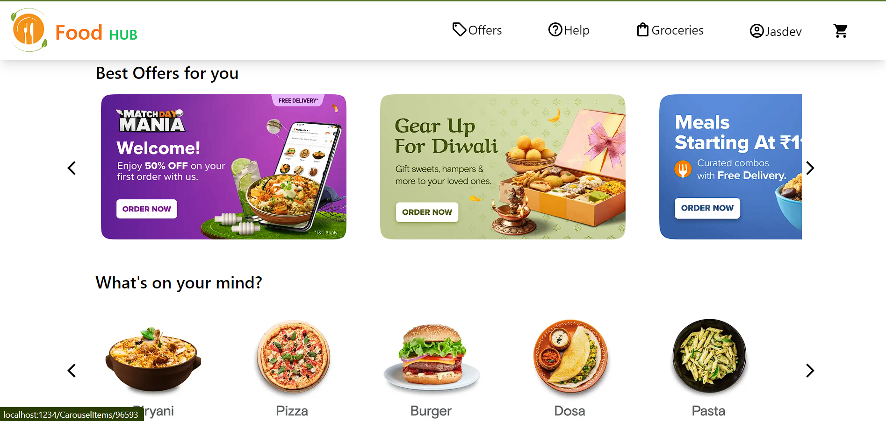
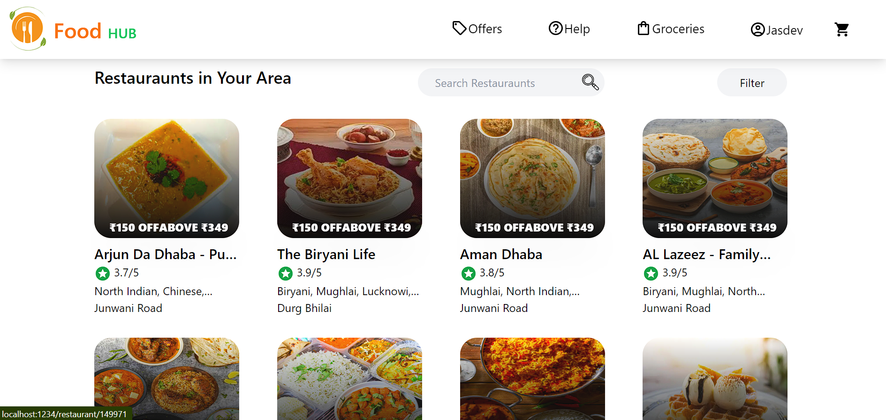
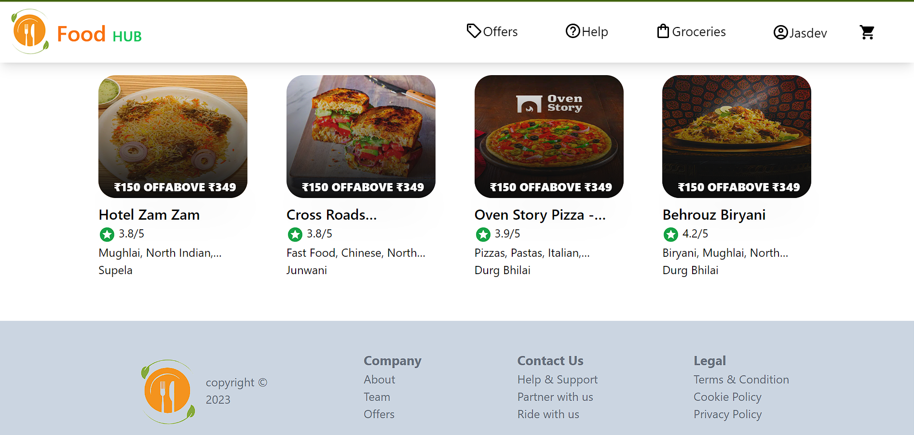
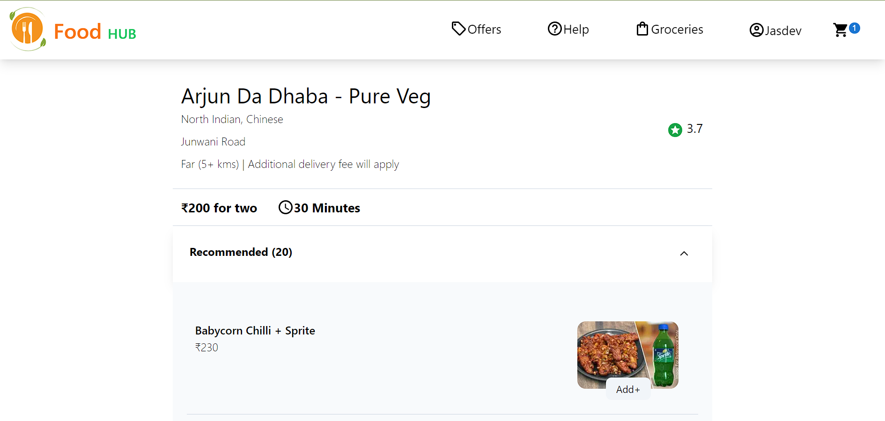
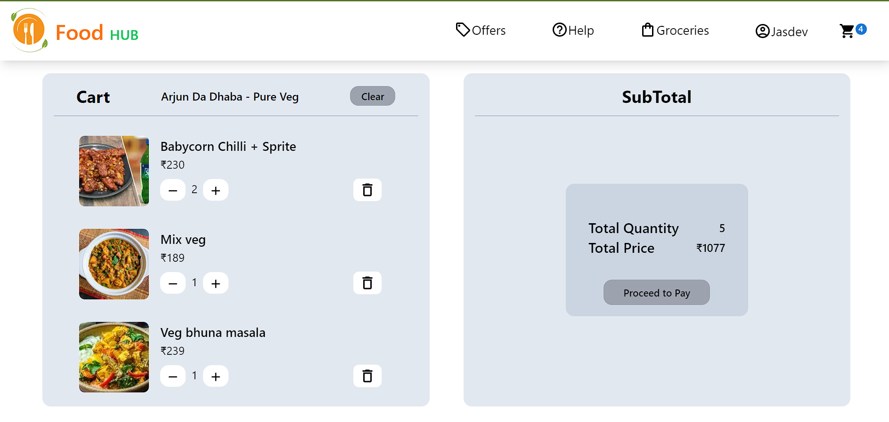
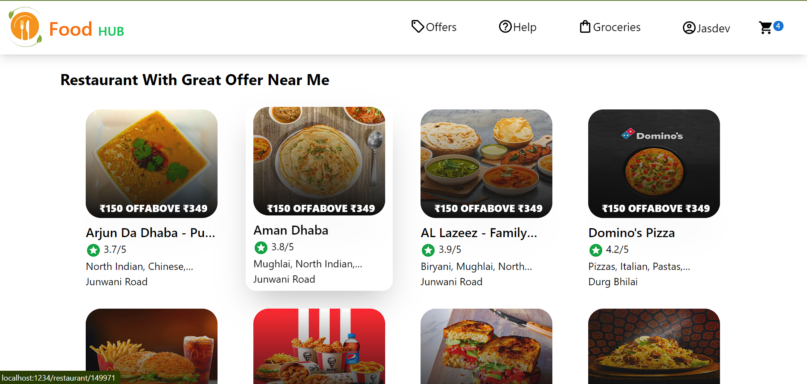
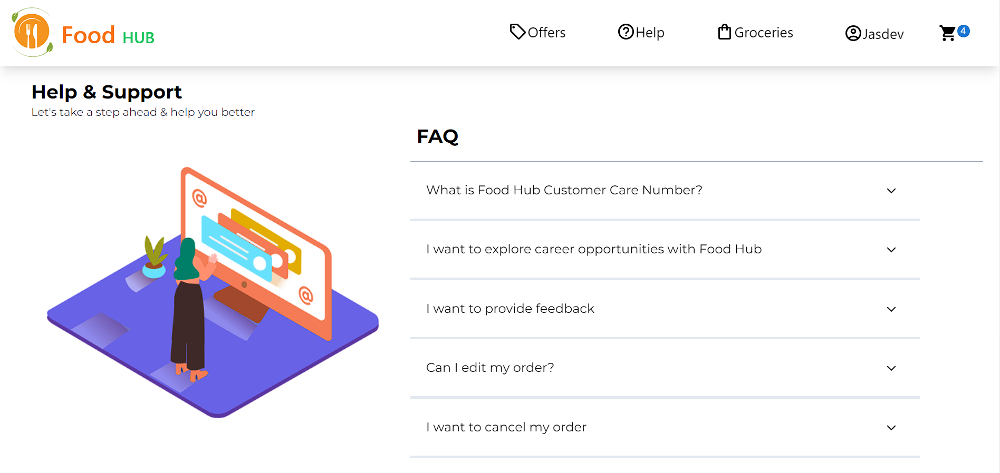
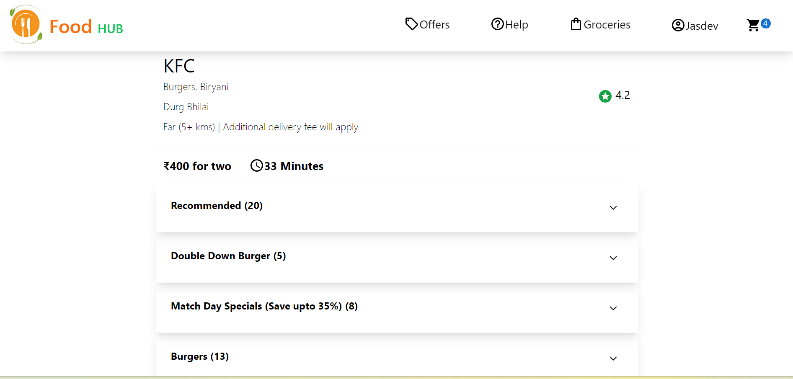
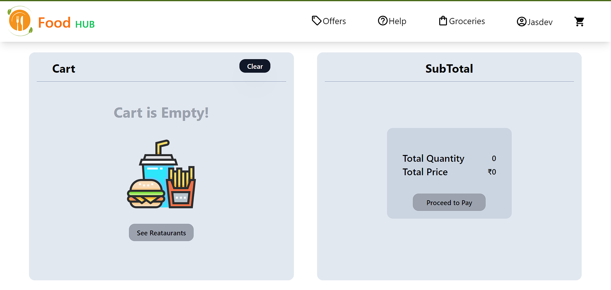

# Food Hub

Welcome to Food Hub! This project is a comprehensive exploration of React and its associated technologies, guided by the exceptional Akshay Saini. Throughout this course, we learned React fundamentals and developed a dynamic application that integrates with Swiggy's Live API.

## Key Features

- **Search Restaurants**: Discover restaurants in your area.
- **View Menu**: Explore restaurant menus and make informed choices.
- **Add to Cart**: Conveniently add items to your cart with options for updating or removing items.
- **Filter Restaurants**: Easily filter and find the restaurants that match your preferences.
- **Explore Exclusive Offers**: Keep an eye out for exclusive deals and offers.
- **Data-Driven UI**: The user interface is designed with data in mind, ensuring a seamless and engaging experience.
- **Dynamic Routing**: Utilize dynamic routing for a smooth navigation experience.

## Ongoing Development

Our project is a work in progress, and we're committed to enhancing its functionality and user experience. Here are some of the exciting features we plan to add in the future:

- **Authentication**: Secure user access with authentication.
- **Dark Mode**: Enable a dark mode for a personalized visual experience.
- **Responsiveness**: Optimize the project for various devices and screen sizes.
- **Improved Search and Filter**: Enhance search and filter capabilities for efficiency.
- **Infinite Scrolling**: Implement infinite scrolling for smooth content browsing.

## Acknowledgments

We owe a tremendous debt of gratitude to our teacher and mentor, Akshay Saini, whose guidance and expertise have been instrumental in our journey to becoming proficient React developers. His commitment to teaching in a hands-on, practical manner has made this project a rewarding learning experience.

## Getting Started

To get started with this project, follow these steps:

1. **Clone the Repository**: Clone this repository to your local machine.

   ```bash
   git clone https://github.com/your-username/swiggy-live-api-project.git
   ```

2. **Install Dependencies**: Navigate to the project folder and install the required dependencies.

   ```bash
   npm install
   ```

3. **Run the Application**: Start the development server and run the application.

   ```bash
   npm start
   ```

The application should now be accessible in your web browser at `http://localhost:3000`.

## Screenshots











## Contribution

We welcome contributions from the community to help improve this project further. If you have suggestions, find issues, or wish to contribute, please feel free to create pull requests or open new issues in this repository.
